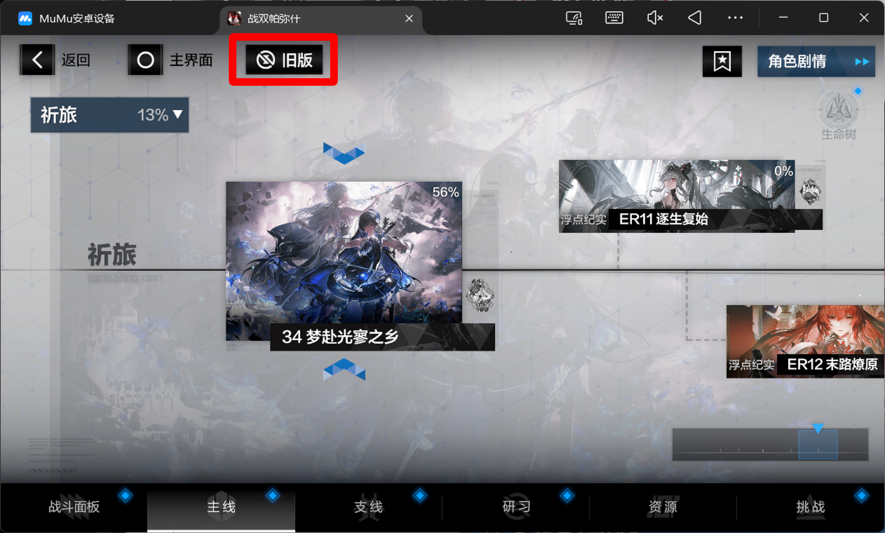

# 战双帕弥什 RPA 全自动主线助手 🚀

一个帮你全自动推战双主线剧情/关卡的脚本。
遇到复杂互动无法通过的关卡，脚本会自动跳过并继续推后面的关卡，直到通过所有能通过的副本。

---

## 🛠️ 如何使用？

1. **游戏准备**：电脑打开模拟器，进入《战双帕弥什》，点进**主线剧情界面**。
2. **关键设置**：请务必在主线界面中，将界面样式**设置为【旧版】**。
    
3. **一键启动**：下载本项目的 Release 压缩包，解压到本地，直接双击运行里面的 **`.exe` 文件**即可。

---

## 🛑 声明

- 本项目完全免费开源，仅供自动化技术交流与学习使用。
- 严禁任何人将本项目用于任何商业牟利或倒卖行为！
